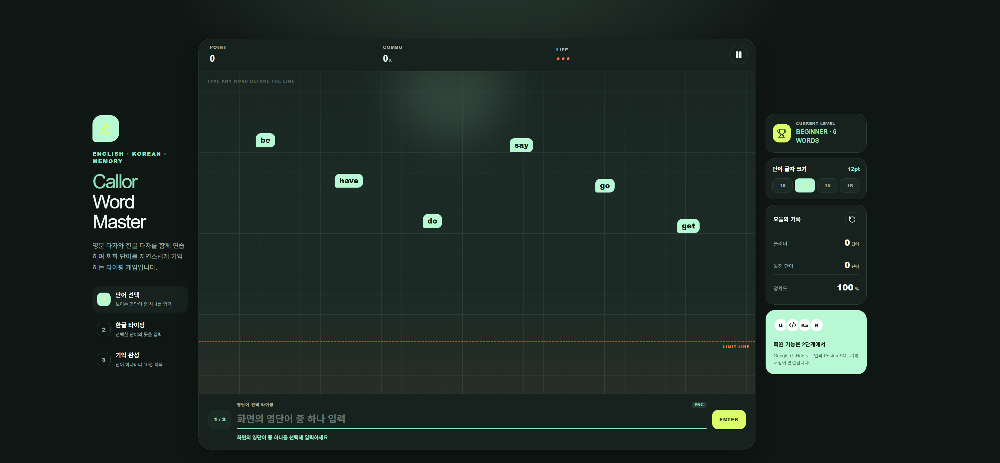
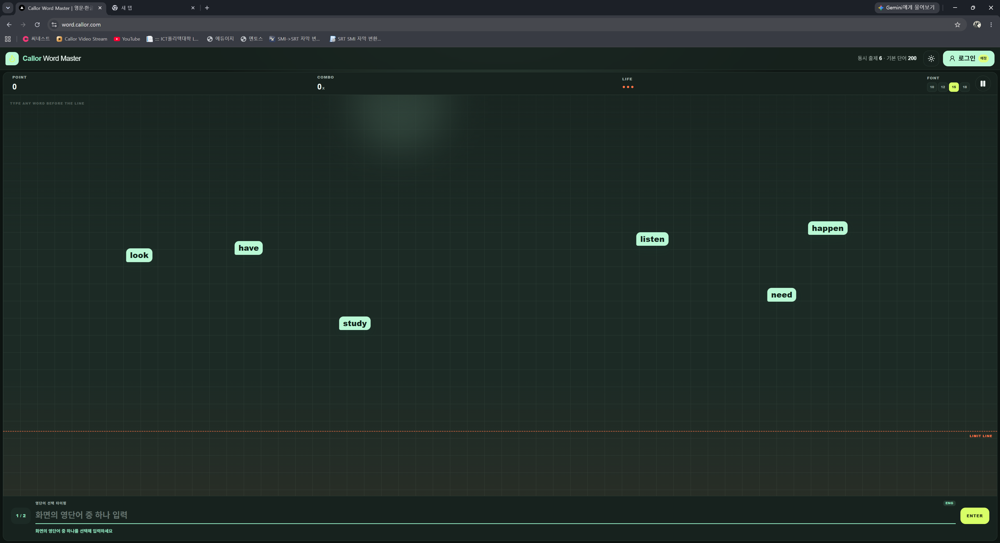

# Callor Word Master

## Update 0.1.4 요구사항

1. PC 화면의 좌우 여백을 없애고 가운데 게임창을 최대로
2. PC 화면의 상하 크기를 Top(Header), Botton(Footer)에서 약간의 여백만 남기고 최대로
3. 내려오는 단어가 좀더 무작위 순서로해서 게임 스럽게

요청하신 화면 구성과 무작위 출제 방식을 적용한 v0.1.4입니다.

[Callor-Word-Master-v0.1.4-Phase1](../Callor-Word-Master-v0.1.4-Phase1/)

주요 변경 사항:

- PC 좌우 여백을 약 `7px`로 축소
- PC에서 왼쪽 브랜드와 오른쪽 통계 패널 숨김
- 상단 헤더를 `58px`로 축소
- 헤더 아래부터 화면 하단까지 게임창이 사용
- 별도 푸터 공간 제거
- 글자 크기 선택 기능을 게임창 상단 점수 영역으로 이동
- 최초 출제 단어 6개를 무작위로 선택
- 단어의 가로 위치와 시작 높이를 무작위 배치
- 단어마다 낙하 속도를 다르게 적용
- 정답 후 새 단어의 등장 시점을 무작위 처리
- 최근 30개 단어 반복 억제 유지
- 태블릿과 모바일에서는 기존 반응형 보조 화면 유지

데이터베이스 변경은 없으므로 마이그레이션과 Seed를 다시 실행할 필요는 없습니다.
