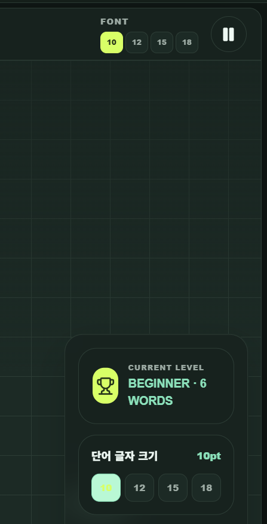

# Callor Word Master

## Update 0.1.6요구사항

전체적으로 괜찮아 보여

1. 각 단어들의 내려오는 속도가 무작위로 빠른 것도 있고 느린것도 있도록
2. 오른쪽 Level 박스 아래에 글자크기가 있는데 오른쪽 상단에 "Font..." 항목이 필요할까
3. 글자 크기는 10p, 12p, 15p, 20p, 25p 로 설정해줘

요청하신 내용을 적용한 v0.1.6 패키지입니다.

[Callor-Word-Master-v0.1.6-Phase1.zip](sandbox:/workspace/scratch/84dfd0de127a/Callor-Word-Master-v0.1.6-Phase1.zip)

변경 사항:

- 단어별 낙하 속도를 크게 차등화
  - 느린 단어: 약 30%
  - 보통 속도: 약 45%
  - 빠른 단어: 약 25%

- 단어가 새로 등장할 때마다 속도 다시 무작위 결정
- 상단의 중복 `FONT` 설정 완전 제거
- 오른쪽 Level 아래의 글자 크기 설정만 유지
- 글자 크기를 다음과 같이 변경
  - `10pt`
  - `12pt`
  - `15pt`
  - `20pt`
  - `25pt`

- 선택한 글자 크기는 `localStorage`에 계속 저장
- 게임 초기화 후에도 단어 위치와 속도를 다시 무작위 배정

데이터베이스와 Prisma 구조는 변경되지 않았습니다. 마이그레이션이나 Seed를 다시 실행할 필요는 없습니다.
