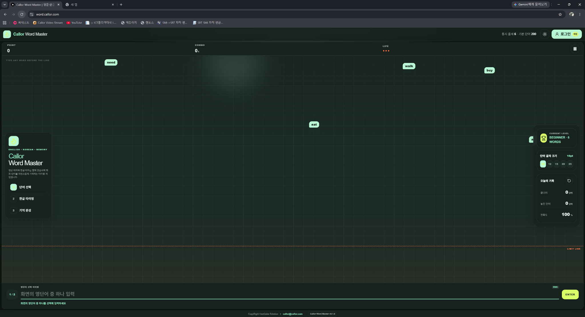

# Callor Word Master

## Update 0.1.7 요구사항

1. 왼쪽 오른쪽 메시지 박스때문에 단어가 가려지는데, 두번째 이미지 처럼 배치를 하면 좋겠어

[1785908920866](image/13.1단계.Update.1.1.7/1785908920866.png)

두 번째 이미지처럼 좌우 패널과 게임 영역을 분리한 v0.1.7 패키지입니다.

[Callor-Word-Master-v0.1.7-Phase1](../Callor-Word-Master-v0.1.7-Phase1/)

변경 사항:

- PC 화면을 독립적인 3열 구조로 변경
  - 왼쪽: 브랜드와 게임 단계
  - 가운데: 영단어 낙하 게임
  - 오른쪽: 레벨·글자 크기·오늘의 기록

- 좌우 패널의 오버레이 방식 제거
- 단어가 좌우 패널에 가려지는 문제 해결
- 화면 전체 폭과 높이 활용
- 좌우 패널 너비는 제한하고 중앙 게임창에 남은 폭을 모두 배정
- 넓은 화면에서도 좌우 패널이 불필요하게 커지지 않도록 제한
- 기존 고정 Footer와 폭발 효과 유지
- 태블릿·모바일 반응형 구조 유지

데이터베이스 변경은 없어 마이그레이션이나 Seed를 다시 실행할 필요가 없습니다.
