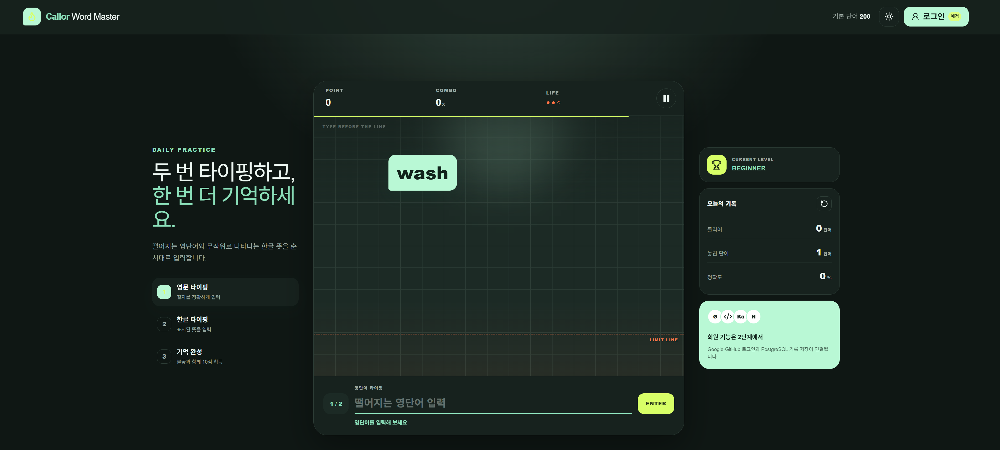

# Callor Word Master

## 요구사항

> 1 단계 프로젝트 패키지를 작성해줘

## 응답

`Callor Word Master` 1단계 프로젝트 패키지를 완성했습니다.

[Callor-Word-Master-v0.1.0-Phase1](../Callor-Word-Master-v0.1.0-Phase1/)



포함 기능:

- 반응형 영단어 낙하 게임
- 영문 입력 → 무작위 한글 뜻 → 한글 입력
- 정답 불꽃 효과와 10점 지급
- 콤보·생명·정확도·클리어 기록
- 라이트·다크 테마 및 `localStorage` 저장
- 회화 기본 단어 200개
- PostgreSQL·Prisma 7 스키마
- 재실행 가능한 Prisma Seed
- Auth.js 확장용 회원·계정·세션 모델
- Google·GitHub 및 향후 Kakao·Naver 로그인 확장 구조
- 실행·DB 설정 설명서

실행 방법:

```bash
unzip Callor-Word-Master-v0.1.0-Phase1.zip
cd callor-word-master

npm install
npm run dev
```

브라우저 접속:

```text
http://localhost:3000
```

PostgreSQL 연결은 `.env.example`을 `.env`로 복사한 후 진행합니다.

```bash
cp .env.example .env

npm run db:generate
npm run db:migrate -- --name init
npm run db:seed
```

ESLint, TypeScript, Prisma 스키마와 200개 단어 데이터 검증은 통과했습니다. 현재 제한된 작업 환경에서는 시스템 메모리 통계 접근 문제로 Next.js production build의 최종 실행 검증만 완료하지 못했으며, 일반 개발환경에서는 `npm run build`로 확인할 수 있습니다.
